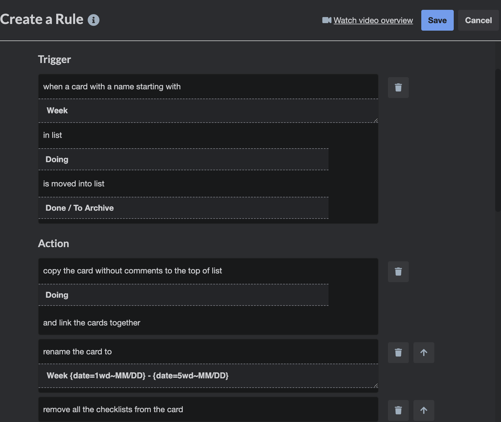
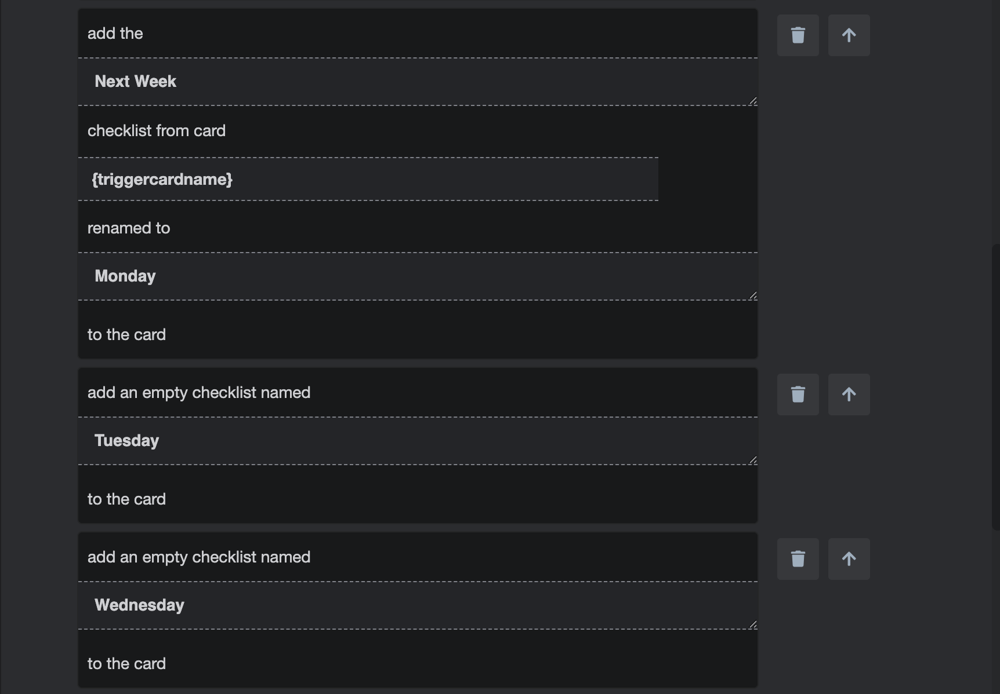
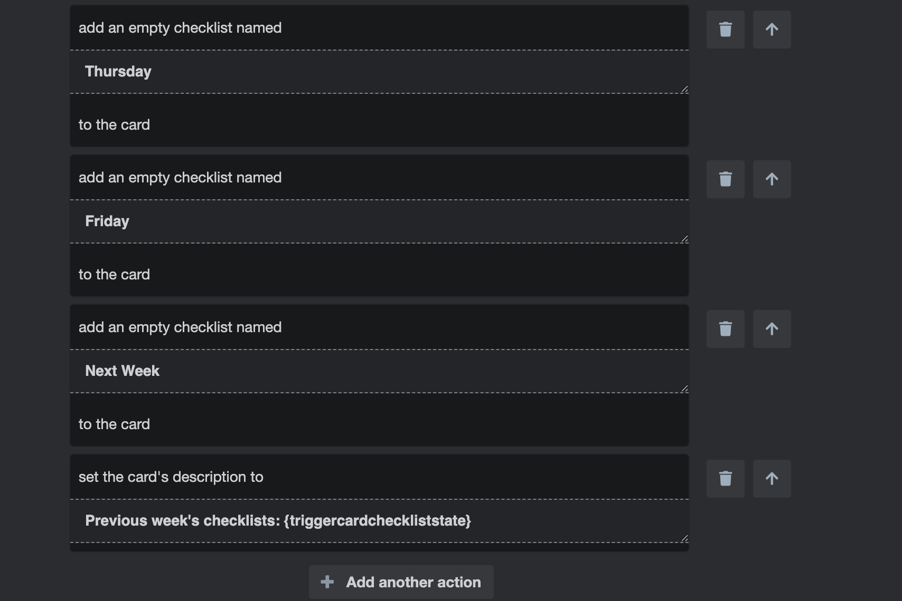
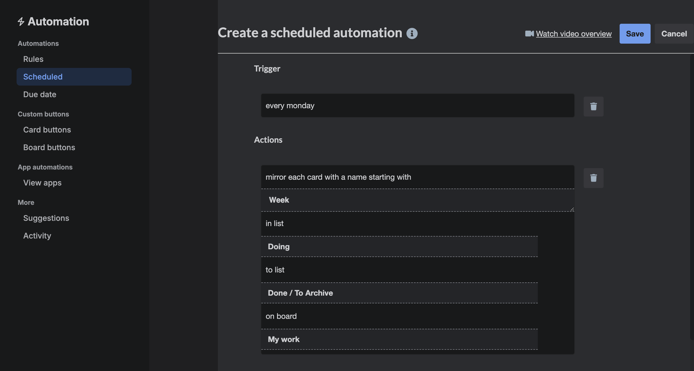

# Home config and other tips and snippets

Some home config and scripts usually used on my macbook pro

## All Operating Systems (probably)

These are mainly used on my macbook pro running macos, but they should work on linux as well.

### Zsh

The config available in `./home/.zshrc` should probably not be used as is but it contains useful things like the plugins list.

### Kitty

Make sure the terminal works fine when connecting to another server: `kitten ssh <server>`. The current `.zshrc` file contains an alias for `ssh`.

### Default CLI editor

If the default CLI editor isn't suitable, it can be changed with `sudo update-alternatives --config editor` (in ubuntu).

## Macos specific

### Window management - Rectangle

Source: https://rectangleapp.com/

Follow the installation instructions.

The list of keyboard shorcuts is available when clicking in the top bar icon, here are the most common (azerty keyboard, if that matters):

- move and resize window to left half: `^ ⌥ ←`
- move and resize window to right half: `^ ⌥ →`
- resize window to full screen: `^ ⌥ ↵`
- make window smaller: `^ ⌥ )`
- make window larger: `^ ⌥ -`
- move window to screen on the right: `^ ⌥ ⌘ + →`

The default settings are fine.

### Window switcher - DockDoor

Source: https://dockdoor.net/

Follow the installation instructions.

#### Config

I've exported my current settings using the following:

```
defaults export com.ethanbills.DockDoor ./settings/DockDoorSettings.plist
plutil -convert xml1 ./settings/DockDoorSettings.plist
# If any changes are made to the file, make sure it's still valid
plutil ./settings/DockDoorSettings.plist
# it should display something like: ./settings/DockDoorSettings.plist: OK
```

Then I removed a few keys specific to my current setup (persistedWindowOrder array).

To import my settings:

```
defaults import com.ethanbills.DockDoor ./settings/DockDoorSettings.plist
# Not sure if that's needed or if it even works, it's supposed to:
# "force macOS to flush its preferences cache so it registers the imported changes immediately"
killall cfprefsd
```

### Mouse manager

For some reason, scrolling naturally is shared between the trackpad and the mouse. An app like LinearMouse can make them independent and improves speed, acceleration and button management.

Source: https://linearmouse.app/en/

Install via homebrew: `brew install --cask linearmouse`

Then, if using my logitech G500 (not sure if it'll work with any other mouse), import my settings:

```
mkdir -p ~/.config/linearmouse
cp ./home/.config/linearmouse/linearmouse.json ~/.config/linearmouse/linearmouse.json
```

Then start/restart linearmouse.

## Snippets

### node.js

#### Enable debugger on a running process

Run the following commands with direct access to the process, so inside a container if necessary.

```bash
/app $ pgrep -a node
1 node
28 /usr/local/bin/node
# 28 is the one we want in our containers

# this won't kill the process
/app $ kill -USR1 28

# this will return some details about the debugger
/app $ wget http://127.0.0.1:9229/json
```

#### Extract current memory dump

Once the debugger is enabled, the following script can be run to write the memory snapshot to a local file. There may be a simpler method, with a call to an endpoint, but this one worked:

```bash
node -e '(async()=>{const fs=require("fs");const list=await (await fetch("http://127.0.0.1:9229/json/list")).json();if(!list[0]?.webSocketDebuggerUrl)throw new Error("No inspector target");const ws=new WebSocket(list[0].webSocketDebuggerUr
l);const chunks=[];ws.onmessage=(ev)=>{const m=JSON.parse(ev.data);if(m.method==="HeapProfiler.addHeapSnapshotChunk")chunks.push(m.params.chunk);if(m.id===1){fs.writeFileSync("/tmp/prod.heapsnapshot",chunks.join(""));console.log("written /tmp/pro
d.heapsnapshot");ws.close();}};ws.onopen=()=>ws.send(JSON.stringify({id:1,method:"HeapProfiler.takeHeapSnapshot",params:{reportProgress:false}}));})();'
```

### bash / zsh

#### dates

Convert a timestamp to a human readable date:

`date -r {timestamp}`

#### history

Ignore command history in a newly opened zsh shell, e.g. to avoid having sensitive info stored in history:

`unset HISTFILE`

If you `echo $HISTFILE` before, it’ll return something like `/Users/shaun/.zsh_history`.

To ignore individual commands, just prefix them with a space.

### docker

#### delete an image and its running containers

In this example, we’re deleting “local/my-container”:

`docker ps -a | awk '{ print $1,$2 }' | grep local/my-container | awk '{print $1 }' | xargs -I {} docker rm -f {} && docker rmi -f local/my-container:local`

### mongodb

#### null values

Search for documents that have the `myUpdatedDate` field set to null and ignore those that don't have the field. Using only `myUpdatedDate: null` doesn't ignore the documents that don't include the field.

`db.MyDb.find({myUpdatedDate: {$type: "null" }},{_id:1, createdAt:1}).sort({_id:-1}).limit(5)`

### Run a local dev http server using python

`python3 -m http.server 8080 --directory .`

## Keyboard shortcuts

### Macos

- display/hide hidden files in Finder: `cmd + shift + .` (or `;` on azerty)
- insert unbreakable space: `alt + space`

### Vscode (macos)

- scroll up/down without moving the cursor: `ctrl + fn + up/down`
- default command input: `cmd + p`. Type one of those characters to add a filter:
  - (none): by file
  - `@`: by symbol in the current file (same as `cmd+shift+o`)
  - `#`: by symbol in the workspace’s currently opened files (same as `cmd+t`)
  - `>`: by command (same as `cmd+shift+p`)

### Kitty

- display command line for `less`, useful to search in command output, eg by then using `:` or `?`: `ctrl + shift + h`
- undo latest command in shell: `ctrl + shift + :`

## Trello

### New weekly card with daily checklists

By using Butler (Automation), we can automate the creation of a card every Monday morning:

- the previous week's card will be moved to a "Done / To Archive" list
- a new card entitled with the current week's dates will be created in the "Doing" list
- the new card will have its description filled in with the previous week's checklists
- the new card will have 1 checklist per day and an extra "Next Week"
- the previous card's "Next Week" checklist's content is moved to the new one's "Monday"

:warning: The rule is activated and creates a new card when a card entitled `Week*` is moved to the "Done / To Archive" list.

For this exact automation, you'll need two lists: "Doing" and "Done / To Archive".

Unfortunately, Trello doesn't currently (2026/08/12) allow easy automation import nor sharing outside of the workspace, so the following texts are just indicators of what the end result should look like. I'll add screenshots of what the contents in the web UI actually look like.

:grey_exclamation: Checklists are added manually and not simply reset with "Monday" imported at the end because it would have been added at the end. AFAIK checklists can't be moved.
In Butler's rules, create one with this content: `when a card with a name starting with "Week" in list "Doing" is moved into list "Done / To Archive", copy the card without comments to the top of list "Doing" and link the cards together, rename the card to "Week {date=1wd~MM/DD} - {date=5wd~MM/DD}", remove all the checklists from the card, add the "Next Week" checklist from card "{triggercardname}" renamed to "Monday" to the card, add an empty checklist named "Tuesday" to the card, add an empty checklist named "Wednesday" to the card, add an empty checklist named "Thursday" to the card, add an empty checklist named "Friday" to the card, add an empty checklist named "Next Week" to the card, and set the card's description to "Previous week's checklists: {triggercardcheckliststate}"`

<!-- markdownlint-disable MD033 -->
<details>
  <summary>Screenshots of the rule</summary>

  

  

  
</details>
<!-- markdownlint-enable MD033 -->

In Butler's schedules, add this one: `every monday, move each card with a name starting with "Week" in list "Doing" to list "Done / To Archive"`

<!-- markdownlint-disable MD033 -->
<details>
  <summary>Screenshot of the schedule</summary>

  
</details>
<!-- markdownlint-enable MD033 -->

To create your first card, create one in a "Doing" list, entitled `Week initial`.

In this card, create a checklist entitled `Next Week`.

Move the card to the "Done / To Archive" list.

A new card entitled `Week MM/DD - MM/DD` (dates should be Monday and Friday's) should have been created in "Doing", with the expected description and checklists.
